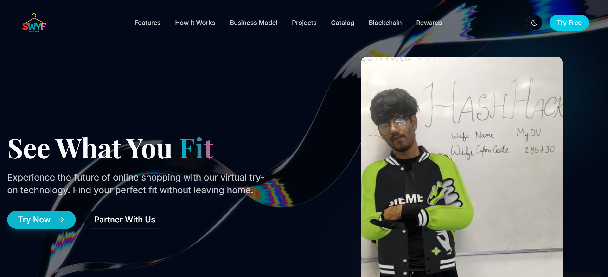

# SWYF Demo Video

This demo video showcases the key features of the SWYF platform:

- Virtual try-on experience with various clothing items
- Color analysis and personalized recommendations 
- User interaction with the 3D elements
- Rewards system overview
- Mobile responsiveness features

## How to View the Demo

1. **Download the video**: The demo video is located at `frontend/DEMO.mp4` in the repository
2. **Play locally**: Use your preferred video player to watch the demo
3. **Alternative**: Clone the repository to access all demo materials

## Preview

## Getting Started

After watching the demo, refer to the installation instructions in the main README to set up the project locally. 